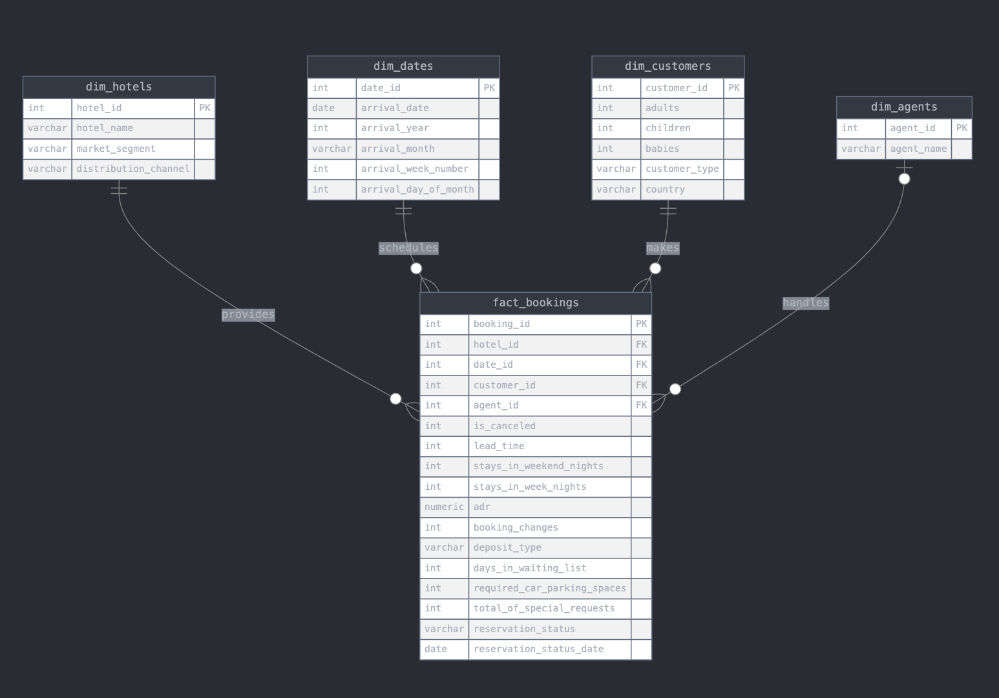

# 🏨 Hotel Booking Analytics & Forecasting

This project provides an **end-to-end data pipeline** and **interactive dashboards** for a hotel chain to visualize booking trends, cancellations, and revenue patterns. Additionally, it includes a **Prophet-based time series forecasting model** to predict future booking demand.

## **📌 Features**
✅ **ETL Pipeline**: Extracts, cleans, and loads booking data into PostgreSQL.  
✅ **Star Schema Data Warehouse**: Optimized for fast querying.  
✅ **Streamlit Dashboards**: Interactive charts for trends, cancellations, and revenue.  
✅ **Time Series Forecasting**: Uses **Prophet** to predict hotel bookings.  

---

## **📂 Project Structure**

📁 case 
  ```bash
        │── .env # PostgreSQL credentials (Didn't ignore in gitignore)
        │── etl.py # Cleans & loads data into PostgreSQL 
        │── app.py # Streamlit dashboard (trends, cancellations, revenue, forecasting) 
        │── utils.py # Utility functions
        │── requirements.txt # Project dependencies
        │── README.md 
        │── images/ # Images
        │── notebook.ipynb # Jupyter Notebook
  ```

# 🏗️ Data Engineering

## 📂 ETL Pipeline

- **File:** `etl.py`
- **Purpose:**
  - Cleans `Users/berat/Desktop/data/hotel_bookings.csv`
  - Loads data into PostgreSQL (Star Schema)
- **Schema:**
  - **Fact Table:** `fact_bookings` (booking transactions)
  - **Dimension Tables:** `dim_hotels`, `dim_dates`, `dim_customers`, `dim_agents`, `dim_companies`
- **Commands to Run:**
  ```bash
  python etl.py
  ```


### 🔍 What Happens When You Run the ETL Pipeline?

1. **Load Data**: Reads `hotel_bookings.csv` into a Pandas DataFrame.

2. **Clean Data**:
   - Fills missing values for `children`, `country`, and `agent`.
   - Drops `company` column due to excessive missing values.
   - Converts `reservation_status_date` to a `datetime` format.
   - Removes duplicate rows.

3. **Transform Data**:
   - Splits data into dimension tables (`dim_hotels`, `dim_dates`, etc.).
   - Creates unique mappings for hotels, dates, customers, and agents.

4. **Load Data into PostgreSQL**:
   - Inserts dimension data first.
   - Maps foreign keys correctly.
   - Inserts fact bookings while ensuring referential integrity.


## 🏨 Data Analysis

### 📊 Booking Trends Analysis
- **Monthly Booking Patterns:** Analyzed how bookings fluctuate across months and years.
- **Peak Seasons:** Identified the busiest months for hotel bookings.
- **Year-over-Year Comparison:** Compared booking trends across different years.

### ❌ Cancellation Analysis
- **Cancellation Rate Trends:** Measured the percentage of bookings that were canceled.
- **Cancellation Seasonality:** Examined whether cancellations spike during specific months.
- **Cancellation by Hotel Type:** Compared cancellation rates across different hotel types.

### 💰 Revenue Analysis
- **Monthly Revenue Trends:** Analyzed revenue generation patterns over time.
- **Impact of Cancellations on Revenue:** Estimated lost revenue due to cancellations.
- **Revenue per Hotel Type & Customer Segment:** Determined which hotels and customer types generate the most revenue.


## 🔢 Time Series Forecasting

### How Forecasting Works

- **Model**: We use **Facebook's Prophet** to predict future hotel bookings based on historical trends.

- **Data Preparation**:
  - Extract historical booking data from PostgreSQL.
  - Convert `arrival_year` and `arrival_month` into a proper date format.
  - Structure the data to match Prophet’s `ds` (date) and `y` (target variable) format.

- **Training & Prediction**:
  - Train the Prophet model with **yearly seasonality** enabled.
  - Generate forecasts for the **next 12 months**.
  - Visualize forecasts along with actual historical data and uncertainty intervals.

- **Interpretation**:
  - The model captures **seasonality patterns, long-term trends, and fluctuations**.
  - Forecast uncertainty is represented using **upper and lower bounds**.

### How This Helps Answer the Question

- **Forecasting Demand**: The model predicts future booking volumes, helping hotels **prepare for high and low seasons**.
- **Incorporating External Factors**: The model can be extended to include **weather, holidays, and local events**, making predictions more accurate.


## 📊 Business Intelligence Dashboards

- **File:** `app.py`

- **Purpose:**
  - Provides two tabs: **Dashboard** and **Forecast**.
  - **Dashboard Tab**: Displays **booking trends, cancellation rates, and revenue**.
  - **Forecast Tab**: Predicts **hotel bookings for the next 12 months** using Prophet.
  - Uses **Plotly** for interactive visualizations.

### 🏃 Run the Streamlit App

```bash
streamlit run app.py
```


## 📊 Visualizations & Insights

### 📈 Booking Trends
- **Metric:** Total bookings per month
- **Insight:** Identifies peak seasons

### ❌ Cancellation Rates
- **Metric:** % of canceled bookings
- **Insight:** Helps reduce revenue loss

### 💰 Revenue Trends
- **Metric:** Monthly revenue from bookings
- **Insight:** Tracks financial performance

### 📉 Booking Forecast
- **Model:** Prophet (Facebook’s forecasting model)
- **Output:** 12-month future demand prediction


## 🛠️ Technologies Used

✅ **PostgreSQL** (Data warehouse)  
✅ **Streamlit** (Dashboard UI)  
✅ **Prophet** (Forecasting model)  
✅ **pandas** (Data manipulation)  
✅ **Plotly** (Charts & graphs)  
✅ **psycopg2** (PostgreSQL connection)  


## 📩 Contact

📧 **Email:** [abdullahberakucuk@gmail.com](mailto:abdullahberakucuk@gmail.com)  
🔗 **LinkedIn:** [Abdullah Bera Kucuk](https://www.linkedin.com/in/abdullahberakucuk/)


